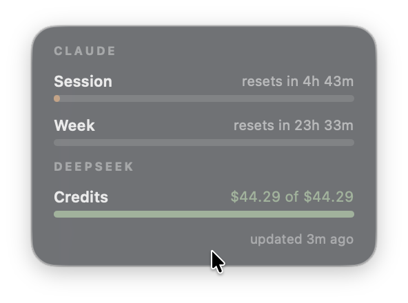

# Usage Pill

A tiny always-on-top macOS widget that shows all your AI usage meters in one
pill: your Claude plan windows (the **5-hour session** and **weekly** bars)
plus any number of API credit balances — DeepSeek ships as a preset, and any
GET-JSON endpoint can be added through a guided custom flow (paste a URL and
a key, tap the number you recognize). Credit rows render as **drain bars**
against a per-launch high-water baseline, with per-provider accent colors and
optional warn thresholds. Hover expands the pill into a card with reset
countdowns, full balances, and data freshness.

<p align="center">
  
</p>

- Floats above every window, on every Space, including over full-screen apps.
- Drag it anywhere; the position survives restarts and display changes.
- Claude bars turn muted amber at 80% and soft red at 95%; **Red Alert at 90%
  weekly** (default on) turns both bars red when the week crosses 90%.
- Per-provider visibility: pin rows to the compact pill, show them only when
  expanded, or hide them entirely (hidden Claude rows aren't even fetched).
- Themeable: Dusk/Mist/Sage palettes or fully custom colors, per-provider
  accents, optional account & plan display.
- Plays nice with APIs: polite polling, Retry-After-aware backoff,
  single-instance guard. Native Swift, no dependencies.

## Install

Download `Usage Pill.app.zip` from the
[latest GitHub Release](https://github.com/greatdeepband/usage-pill/releases),
unzip, and drag `Usage Pill.app` to `/Applications`.

The app is signed with a local certificate, **not notarized** — on first open,
right-click the app → **Open** → **Open**, or clear the quarantine flag:

```bash
xattr -dr com.apple.quarantine '/Applications/Usage Pill.app'
```

Enable **Launch at Login** from the gauge icon in the menu bar (works only
from /Applications). Version history: see [CHANGELOG.md](CHANGELOG.md).

## Build from source

Requires macOS 14+ (Apple Silicon) and the Xcode Command Line Tools
(`swift` toolchain).

```bash
./scripts/make-signing-cert.sh   # one-time: stable signing identity (one password prompt)
./scripts/make-app.sh
cp -R "build/Usage Pill.app" /Applications/
open "/Applications/Usage Pill.app"
```

On first launch, approve the keychain prompt with **Always Allow**.

> **Keychain prompts keep coming back?** Claude Code rotates its OAuth token
> about hourly, and each rotation resets the keychain item's access list —
> revoking your "Always Allow" — so the prompt can return on every wake. This
> is Claude Code's behaviour and isn't fixable from Usage Pill's side. The cure
> is a **long-lived token**: open Settings → Claude → Connection → **Use a
> token**, run `claude setup-token`, and paste the result. Usage Pill then
> reads its own keychain item (silent, prompt-free) and never touches Claude
> Code's rotating one. See [Claude](#claude-plan-windows) below.

## Providers

### Claude (plan windows)

Requires a Claude **Pro/Max subscription** with
[Claude Code](https://claude.com/claude-code) logged in on the same Mac. The
widget reads the OAuth token Claude Code stores in your keychain and shows the
exact percentages Claude Code's `/usage` command reports. Access is **strictly
read-only** — it never writes to the keychain, never refreshes or stores
tokens elsewhere, and never logs them. API-key billing has no usage windows to
show, so a Claude Code sign-in is the only supported source.

**Two ways to connect (Settings → Claude → Connection):**

- **Auto-detect** (default) — reads your Claude Code sign-in directly. Zero
  setup, instant data. Downside: Claude Code's hourly token rotation resets the
  keychain access list, so macOS may re-ask for your keychain password on wake.
- **Long-lived token** (no prompts) — run `claude setup-token` in Terminal,
  paste the token into Usage Pill. It's stored in Usage Pill's own keychain
  item (silent reads, never logged or synced) and is immune to Claude Code's
  rotations, so the password prompts stop entirely. If the token ever expires,
  the pill says so and you re-paste a fresh one.

### DeepSeek (preset)

Settings → **Add Provider** → **DeepSeek balance** → paste your DeepSeek API
key → **Add to Pill**. Shows your remaining USD balance as a drain bar.

### Any GET-JSON provider (custom flow)

If your provider has a GET endpoint that returns your balance as JSON, the
guided flow can chart it — no configuration files:

1. Settings → **Add Provider** → **Custom…**
2. Paste the balance **URL** and your **API key** (header defaults —
   `Authorization` / `Bearer {key}` — fit most providers and are editable).
3. **Continue** probes the endpoint and lists every number found in the
   response. **Tap the number you recognize** as your balance.
4. Name the row, choose **Currency** or plain **Number**, optionally set a
   **Warn Below** threshold (bar turns amber under it) and an accent color,
   then **Add to Pill**.

**Key storage promise:** provider keys go to your **keychain only** (service
`pl.bbi.usage-pill.providers`) — never written to config files or defaults,
never logged, never included in error messages, never synced anywhere. The
pasted key travels exactly two places: the probe request and the keychain.

### Template catalog

Settings → **Add Provider** opens a grouped catalog of pre-built entries —
select one and the form fills itself in; adding is always live-verified.
Every entry includes a **Get your key →** link to the provider's key page.

**Plans**
- **Claude** — uses your existing Claude Code sign-in; fresh installs are
  detected automatically, with a guided walkthrough for anything else.
- **z.ai GLM 5-hour** — pre-fills the quota endpoint and raw-token header;
  add once for the 5-hour window.
- **z.ai GLM weekly** — same endpoint, weekly quota field; add alongside the
  5-hour entry to chart both.
- **MiniMax token plan** — pre-fills `token_plan/remains`; pick your
  remaining-quota field for a perfect drain bar.

**API balances & spend**
- **DeepSeek** — remaining USD credit balance as a drain bar.
- **OpenRouter** — pre-fills the credits endpoint and picks the true
  remaining-credits field (not lifetime purchased), so you get a real drain bar.
- **MiniMax balance** — pre-fills `user/balance`; pick the available-balance
  field.
- **OpenAI month-to-date spend** — month-to-date spend via the billing usage
  API (needs an org admin key); uses a warn-ABOVE threshold and skips the
  drain bar because spend grows rather than drains.

### Recipes

**OpenRouter** — URL `https://openrouter.ai/api/v1/credits`, header defaults
as-is. The probe shows `data.total_credits` (lifetime credits purchased) and
`data.total_usage`; the custom flow charts one field and can't subtract, so
pick `total_credits` — or, if your account's endpoint offers a remaining-style
field, pick that one for a true drain bar.

**MiniMax (API balance)** — URL `https://api.minimax.io/v1/user/balance`,
header defaults as-is. Pick the field carrying your available balance.

**MiniMax (Coding/Token Plan)** — URL
`https://api.minimax.io/v1/token_plan/remains`, header defaults as-is
(coding-plan key). Pick your remaining-quota field — remaining quotas make
perfect drain bars (full at window reset, draining as you burn tokens).

**z.ai (GLM Coding Plan)** — URL
`https://api.z.ai/api/monitor/usage/quota/limit`, then open **Advanced** and
change Header Template from `Bearer {key}` to just `{key}` — z.ai expects the
raw token. The probe lists both the 5-hour and weekly quota numbers; add the
provider twice (e.g. "GLM 5h" and "GLM week") to chart both.

`scripts/probe-providers.sh` prints these endpoints' raw responses (no secret
values) if you want to inspect the JSON shape first.

---

**Why no ChatGPT/Codex plan?** OpenAI exposes no public usage API for ChatGPT
subscriptions — the moment one exists, it becomes a template.

## Security & privacy

- Claude credentials: read-only keychain access to Claude Code's stored token
  (item `Claude Code-credentials`), used for exactly one thing — the usage
  query. Cached in memory and re-read only when the token rotates.
- Provider keys: your own keys, stored only in keychain service
  `pl.bbi.usage-pill.providers`, sent only to the host you configured.
- The optional account email display is kept in memory only — never on disk,
  never logged, fetched only while the toggle is on.
- Network traffic is HTTPS to `api.anthropic.com` plus the provider endpoints
  you add — nothing else, no telemetry.
- `scripts/make-signing-cert.sh` adds a local self-signed certificate to your
  *user* trust store for code signing only — read it before running, as you
  should for anything touching your trust settings.

## Develop

```bash
swift test          # unit tests (decoding, credentials, providers, state machine, formatting, geometry)
swift build && .build/debug/ClaudeUsagePill
```

`scripts/probe-usage-api.sh` prints the live Claude usage-endpoint response and
the credential key structure (no secret values) — useful if the API shape
changes.

## Uninstall

Quit from the menu-bar gauge icon (toggle Launch at Login off first if you
enabled it), then:

```bash
rm -rf '/Applications/Usage Pill.app'
defaults delete pl.bbi.usage-pill
```

To remove stored provider keys, delete the items under keychain service
`pl.bbi.usage-pill.providers` in Keychain Access (or
`security delete-generic-password -s pl.bbi.usage-pill.providers` per key).

## Disclaimer

This is an unofficial, personal-use tool, not affiliated with or endorsed by
Anthropic or any provider it charts. The Claude meter calls the same endpoint
Claude Code's `/usage` command uses, which is not a documented public API and
may change or stop working at any time. If it breaks, run
`scripts/probe-usage-api.sh` and compare the response shape with
`Tests/UsageCoreTests/Fixtures.swift`.

## License

[MIT](LICENSE)
